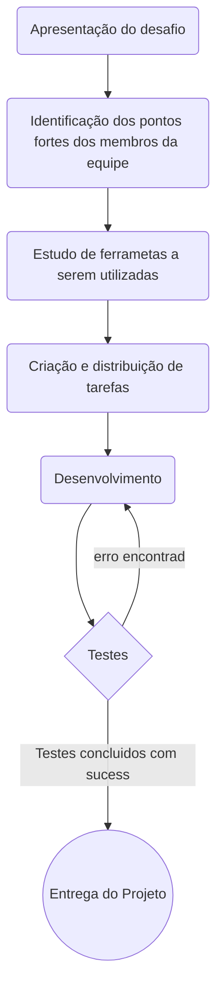

# Hiring coders 3 - Desafio fase 3 

Aqui, apresentamos os trabalhos desenvolvidos pela equipe 4 da casa Bitsized. Descrevemos também critérios organizacionais da equipe para serem avaliados no primeiro item dos Critérios de Avaliação da Fase 3, "Organização de Tarefas". 

A seguir, apresentamos um fluxograma contendo as atividades desenvolvidas pela equipe, tais atividades podem ser vistas com detalhes logo mais abaixo.

## Índice
- [Cenário](#Cenário)

- [Identificação de Pontos Fortes da Equipe](#Identificação-de-Pontos-Fortes-da-Equipe)
- [Estudo de ferramentas a serem utilizadas](#Estudo-de-ferramentas-a-serem-utilizadas)
- [Criação e distribuição de tarefas](#Criação-e-distribuição-de-tarefas)
- [Dificuldades no desenvolvimento](#Dificuldades-no-desenvolvimento)
- [Apresentação da loja](#Apresentação-da-loja)
- [Considerações finais](#Considerações-finais)
- [Membros da equipe](#Membros-da-equipe)

## Cenário
Na quarta-feira,13 de julho de 2022, os estudantes da Fase 3 do Hiring Coders 3 foram incumbidos de utilizarem os conhecimentos construídos nas fases anterios do programa para elaboração de um projeto a ser entregue em uma semana, 20 de julho de 2022. A seguir, expomos o desafio que nos foi proposto pelos organizadores do evento.

>Maria tem uma loja e quer implementar um modelo de recompensa. A cada R$1,00 gasto deve gerar 1 ponto de recompensa. Todo consumidor precisa saber quantos pontos tem em sua carteira virtual, logo um contador deve estar visível para validação do saldo. 
Maria não está preocupada com o uso dos pontos após a geração, pois ela já possui um sistema no qual o usuário final pode utilizar os pontos gerados, mas esse sistema demanda uma API para consultar o saldo e outra para debitar um valor.

## Identificação de Pontos Fortes da Equipe
No dia seguinte a liberação do desafio, 14 de julho de 2022, a equipe 4 da casa Bitsized se reuniu para discusão dos pontos fortes de seus membros e divisão de subequipes. A Divisão se deu dessa forma:

- **Front-end:**(((Escrever aqui membros do front)))

- **Back-end:** (((Escrever aqui membros do back)))

## Estudo de ferramentas a serem utilizadas

Após a organização das times de Front-end e back-end, a equipe 4 fez um estudo minucioso do cenário/problema apresentado para levantamento das tecnologias a serem utilizadas. A seguir, listamos as tecnologias utilizadas no desenvolvimento deste trabalho:

- (((Escrever cada tecnologia. Na utilização de API's não esquecer de colocar referência da documentação.)))
-
-
-
-
-
 

## Criação e distribuição de tarefas
Tendo em mente os times (back-end e front-end) e as tecnologias a serem utilizadas, o próximo passo, naturalmente, foi a distribuição de tarefas. A seguir, exibimos as tarefas de cada time:

- **Back-end**:
> (((Escrever aqui as tarefas do back. Escrever as tarefas em forma de uma lista numerada por ordem de execução  ou, caso a equipe prefira, utilizar um fluxograma.)))

-**Front-end**  
> (((Escrever aqui as tarefas do front. Escrever as tarefas em forma de uma lista numerada por ordem de execução  ou, caso a equipe prefira, utilizar um fluxograma.)))

## Dificuldades no desenvolvimento
Dificuldades podem surgir no desenvolvimento de qualquer projeto, esse não foi diferente. A equipe 4 da casa Bitsized avalia que transpor obstáculos é, sobretudo, uma forma de aprimorar os conhecimentos construídos e descobrir novas soluções. Tendo em vista a importância dos obstáculos no processo de construção do saber, optamos por evidenciar algumas das dificuldades enfrentadas pela equipe e quais soluções foram encontradas, uma vez que este material pode vir a servir de objeto de estudos para  futuros desenvolvedores.

- (Listar aqui problemas, soluções e erros encontradas pela equipe)
-
-
-

## Apresentação da loja

## Considerações finais

## Membros da equipe

A seguir, listamos os membros de nossa equipe, por favor, fique a vontade para visitar as nossas redes sociais e entrar em contato.

<h2>Membros:</h2>

- Christiany Belini Goulart Delfin

  &nbsp;&nbsp;
  &nbsp;&nbsp;

  
- Danilo Antunes
  

  &nbsp;&nbsp;
  &nbsp;&nbsp;

  
- Ericky Carlos Santana Braga 
  

  &nbsp;&nbsp;
  &nbsp;&nbsp;

  
- Felipe Carneiro de Almeida
  

  &nbsp;&nbsp;
  &nbsp;&nbsp;

  
- Jean Silva
  

  &nbsp;&nbsp;
  &nbsp;&nbsp;

   
- Pedro Quintino
  

  &nbsp;&nbsp;
  &nbsp;&nbsp;

